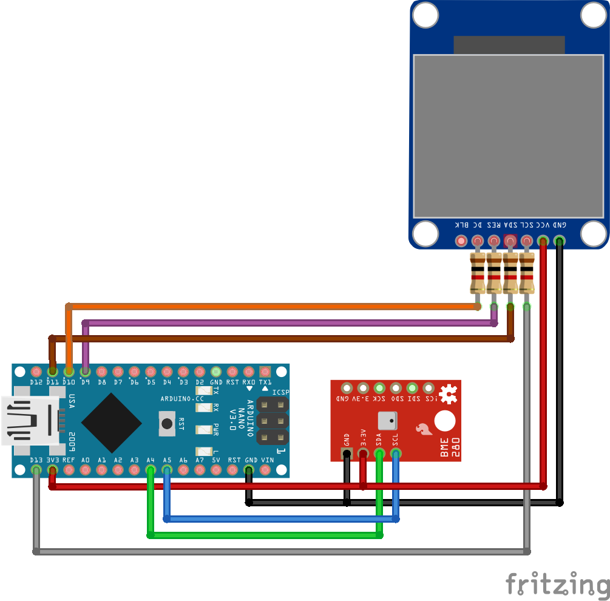

# v1_temp_and_humidity_tft

Monitor temperature and humidty and display them in a LCD screen. They will display in green when in range and in red when out of bounds.

## List of Components

- Arduino Nano
- TFT display 1.3"(240x240) - ST7789
- Humidity sensor BME280 3.3v

## Libraries
- [Adafruit BME280 library](https://github.com/adafruit/Adafruit_BME280_Library) 
- [ST7789_AVR](https://github.com/cbm80amiga/ST7789_AVR) - Fast SPI library for the ST7789 IPS display optimized for AVR Arduinos
- SPI
- Wire

## Documentation

Clone repo, include libraries, set max/min for temperature and humidity ranges and upload it to your Arduino Nano.

## Schematic

